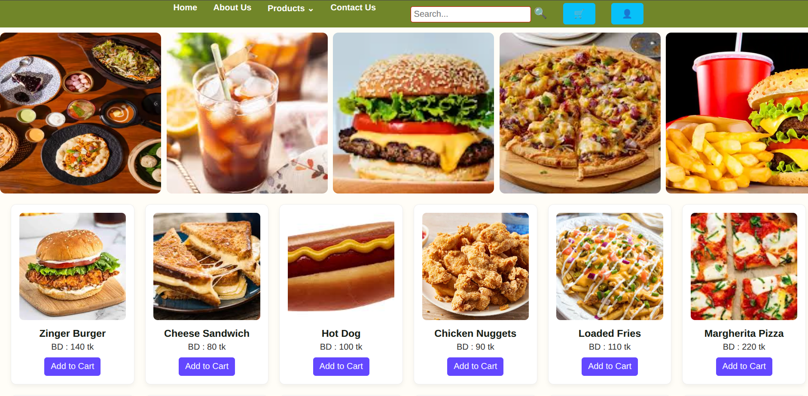
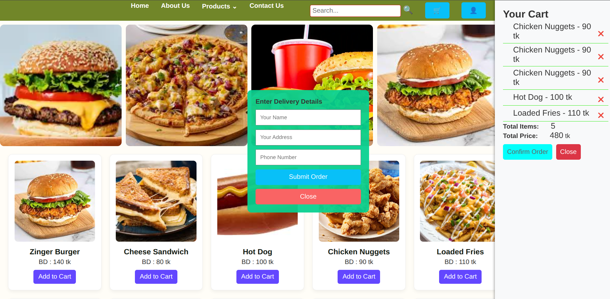
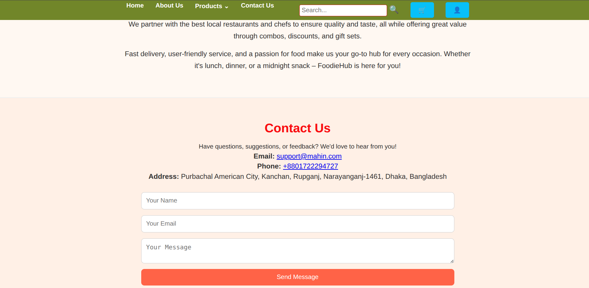

# 🍽️ FoodieHub


Modern restaurant and food ordering web application with responsive UI and smart food management features.

---

## 🌐 Live Demo

## 🌐 Live Demo

[](https://onlinefoodorderingsystemh.netlify.app/)

---

## 🚀 Features

- 🍔 Food Ordering System
- 🛒 Cart Management
- 🔍 Food Search Functionality
- 📦 Order Processing System
- 📱 Responsive Design
- 📞 Contact System
- 🔐 User Authentication
- 🧾 Order Management

---

## 🛠️ Tech Stack

- HTML5
- CSS3
- JavaScript
- PHP
- MySQL

---

## 📸 Screenshots

### 🏠 Home Page


### 🛒 Order Process


### 📞 Contact Us


---

## 📦 Installation

```bash
git clone https://github.com/mahabubhasanmahin/FoodieHub.git
cd FoodieHub
```

---

## ▶️ Run Project

1. Install XAMPP
2. Move project folder to `htdocs`
3. Start Apache & MySQL
4. Import the SQL database file
5. Open browser and visit:

```text
http://localhost/FoodieHub
```

---

## 🗄️ Database Setup

1. Open phpMyAdmin
2. Create a database
3. Import the provided `.sql` file

---

## 🔐 Demo Login

### User Login
Create a new account from the registration page.

### Admin Login
No default admin account is included in this version.

---

## 📁 Project Structure

```text
FoodieHub/
├── css/
├── js/
├── images/
├── database/
├── Result_Screenshots/
├── index.php
└── README.md
```

---

## 👨‍💻 Author

MD Mahabub Hasan Mahin

- 🌐 Portfolio: https://mahabubhasanmahin.netlify.app/
- 💻 GitHub: https://github.com/mahabubhasanmahin

---

## ⭐ Support

If you like this project, give it a ⭐ on GitHub 😄
